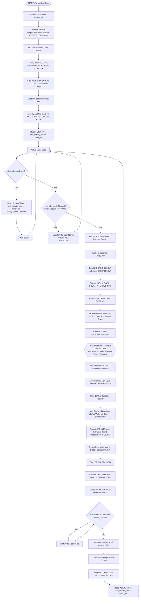

# ATmega328P Low-Power & Interrupt Wake-Up Flowchart

## Overview

This flowchart documents the execution flow of the ATmega328P low-power system, demonstrating normal active operation, inactivity timing via Timer1 CTC mode, Power-Down sleep entry (`SLEEP_MODE_PWR_DOWN`), low-level INT0 external interrupt wake-up, and return to active state.

> [!IMPORTANT]
> **Timer1 Behavior during Sleep**: Timer1 is used solely for active state inactivity timing (5-second timeout). During **Power-down sleep mode**, the synchronous system clock (`clk_I/O`) is stopped, which halts Timer1. Timer1 does NOT run during sleep; it resumes counting after the CPU is awakened by INT0.

---

## Detailed System Flowchart (Mermaid Diagram)

---

## State Transition Description

1. **Initialization**: Configure GPIO ports, LCD 4-bit mode, Timer1 ($1\,\text{ms}$ ticks), and INT0 (Low-level trigger `ISC01=0, ISC00=0`). Enable global interrupts.
2. **Active Mode**: The LED is turned **ON** (`PB0` HIGH). Timer1 increments `system_ticks` every $1.0\,\text{ms}$. The LCD updates the remaining active countdown (`5s...` down to `1s...`).
3. **Inactivity Detection**: If no button press occurs for $5.0\,\text{seconds}$, the active timeout expires.
4. **Sleep Entry**: The LCD displays `"Inactivity Timed / Entering Sleep.."`, waits $1.5\,\text{seconds}$, LED `PB0` turns **OFF**, LCD displays `"MCU: POWER-DOWN / Press SW1 (INT0)"`, INT0 is re-armed, and `enter_power_down()` sets `SMCR` bits `SM2:SM0 = 010` and executes `SLEEP`.
5. **Power-Down State**: The CPU, I/O clock, and Timer1 halt. Oscillator stops. MCU power consumption is greatly reduced.
6. **Interrupt Wake-Up**: Pressing `SW1` pulls `PD2` LOW ($0\text{V}$). Asynchronous low-level detection requests wake-up.
7. **Oscillator Restart & ISR Execution**: The main $16\,\text{MHz}$ oscillator restarts. After the required oscillator startup/wake-up delay, the CPU resumes execution, executes `ISR(INT0_vect)`, sets `wake_flag = 1`, and disables INT0 in `EIMSK` to prevent continuous level-trigger re-entrance.
8. **Post-Wake Execution**: LED turns **ON**, buzzer pulses for $150\,\text{ms}$, LCD prompts user to `"Release Button.."`. Execution blocks in a loop until `SW1` is released.
9. **Return to Active State**: Once `PD2` returns HIGH, `last_activity_time` resets and active mode resumes.
