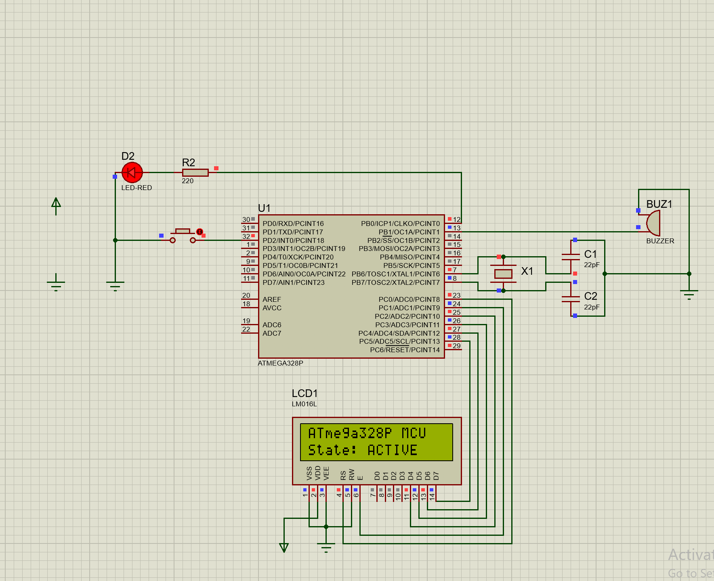
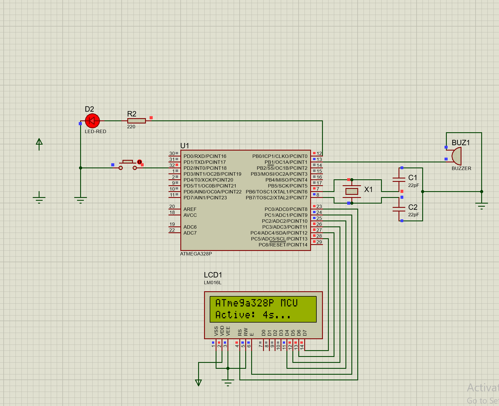
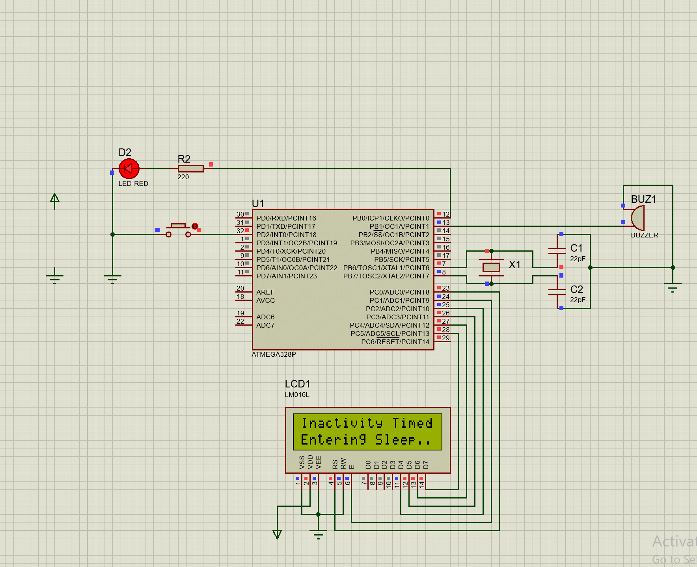
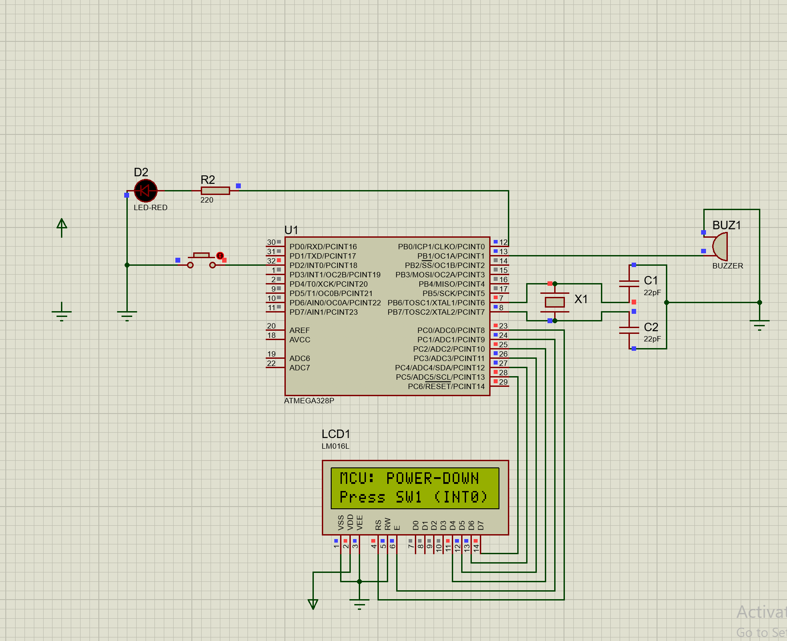

# Part 1 — ATmega328P Low-Power & Interrupt Wake-Up Report

## 1. Introduction

Microcontroller power management is a crucial requirement in modern battery-operated, remote, and energy-constrained embedded systems. Standard microcontrollers operating in active mode continuously consume operating current to drive the CPU core, internal clock networks, and digital peripherals. When system tasks are intermittent, keeping the microcontroller running continuously leads to rapid battery depletion.

This report presents the complete design, register-level C implementation, and Proteus simulation verification for an **ATmega328P Low-Power Demonstration System**. The system implements automatic inactivity monitoring using 16-bit Timer1 CTC mode, places the microcontroller into **Power-Down Sleep Mode** (`SLEEP_MODE_PWR_DOWN`), and utilizes an asynchronous **External Interrupt 0 (INT0)** low-level trigger to wake the microcontroller back to active operation upon user input.

---

## 2. Objectives

The primary technical objectives of Part 1 are:
* **Bare-Metal Register Programming**: Implement all peripheral drivers and low-power control routines directly using AVR hardware registers (`DDRx`, `PORTx`, `PINx`, `TCCR1B`, `OCR1A`, `EICRA`, `EIMSK`, `SMCR`) without using Arduino framework APIs (`digitalWrite`, `digitalRead`, `delay`, `attachInterrupt`).
* **Timer1 CTC Inactivity Monitoring**: Configure Timer1 in Clear Timer on Compare Match (CTC) mode at $16\,\text{MHz}$ to generate a periodic $1.0\,\text{ms}$ system tick counter for active timeout tracking ($5.0\,\text{seconds}$).
* **Power-Down Sleep Implementation**: Implement low-power operation using the ATmega328P Sleep Control Register (`SMCR`) set to `SLEEP_MODE_PWR_DOWN` to halt CPU and peripheral clocks.
* **Low-Level Asynchronous INT0 Wake-Up**: Configure External Interrupt 0 (`PD2 / INT0`) with low-level triggering (`ISC01 = 0, ISC00 = 0`) to wake the MCU from Power-down when a push button is pressed.
* **User Feedback & Status Display**: Interface a 16x2 HD44780 Alphanumeric LCD in 4-bit mode alongside an LED indicator to display system states (`ACTIVE`, `ENTERING SLEEP`, `POWER-DOWN`, `WOKE UP`).
* **Proteus Simulation Verification**: Compile the firmware into binary artifacts (`main.hex` and `main.elf`) using `avr-gcc` and experimentally verify the state transitions in Proteus.

---

## 3. System Architecture & Component Mapping

The physical circuit consists of an ATmega328P microcontroller connected to a $16\,\text{MHz}$ crystal oscillator, a 16x2 HD44780 Alphanumeric LCD, a red status LED, a 5V DC buzzer, a push button switch, and passive biasing components.

### Hardware Pin Mapping Table

| ATmega328P Pin | DIP Pin # | Connected Component | Purpose / Description |
| :--- | :---: | :--- | :--- |
| **PB0** | 14 | **LED D1** via $220\,\Omega$ resistor `R2` | Active/Sleep status indicator (Active HIGH) |
| **PB1** | 15 | **Buzzer BUZ1** | Buzzer output for wake-up feedback |
| **PD2 / INT0** | 4 | **Push Button SW1** (to GND) | External interrupt wake-up input (Active LOW) |
| **PC0** | 23 | **LCD1 RS** | LCD Register Select (Command `0` / Data `1`) |
| **PC1** | 24 | **LCD1 E** | LCD Enable strobe signal |
| **PC2** | 25 | **LCD1 D4** | LCD 4-bit data bus line 0 |
| **PC3** | 26 | **LCD1 D5** | LCD 4-bit data bus line 1 |
| **PC4** | 27 | **LCD1 D6** | LCD 4-bit data bus line 2 |
| **PC5** | 28 | **LCD1 D7** | LCD 4-bit data bus line 3 |
| **PB6 / XTAL1** | 9 | **16 MHz Crystal X1** (with $22\,\text{pF}$ `C1`) | Master clock oscillator input |
| **PB7 / XTAL2** | 10 | **16 MHz Crystal X1** (with $22\,\text{pF}$ `C2`) | Master clock oscillator output |
| **PC6 / RESET** | 1 | **+5V VCC** via $10\,\text{k}\Omega$ pull-up `R4` | Master reset pin (held HIGH) |
| **VCC** | 7 | **+5V Rail** | Digital supply voltage |
| **AVCC** | 20 | **+5V Rail** | Analog supply voltage |
| **GND** | 8, 22 | **0V Rail** | Ground reference |

---

## 4. Software Architecture

The software is structured as **one modular reusable library** paired with an application file, adhering strictly to bare-metal Embedded C principles:

```text
part1-atmega328p/
├── Makefile                        <-- AVR-GCC build script
├── build/
│   ├── main.elf                    <-- Executable ELF binary
│   └── main.hex                    <-- Proteus flash memory image
└── src/
    ├── atmega328p_lowpower.h       <-- Public library header API
    ├── atmega328p_lowpower.c       <-- Register-level driver implementation
    └── main.c                      <-- Application state machine & main loop
```

* **`atmega328p_lowpower.h`**: Defines the public function interfaces, `F_CPU = 16000000UL` clock definition, and peripheral controls.
* **`atmega328p_lowpower.c`**: Implements raw register interactions (`DDRx`, `PORTx`, `PINx`, `TCCR1B`, `OCR1A`, `EICRA`, `EIMSK`, `SMCR`) for GPIO, LCD 4-bit protocol, Timer1 $1\,\text{ms}$ interrupts, INT0 setup, and Power-down sleep entry.
* **`main.c`**: Implements the main state machine, managing active mode countdowns, inactivity timeout checks, sleep entry, wake event processing, and button release debouncing.

---

## 5. Timer1 CTC Configuration ($16\,\text{MHz}$)

Timer1 is configured as a 16-bit Timer in **Clear Timer on Compare Match (CTC) mode** to maintain a periodic millisecond tick counter (`system_ticks`).

### Register Setup
* **`TCCR1A = 0`**: Standard I/O port operation, disconnected compare output pins.
* **`TCCR1B |= (1 << WGM12)`**: Selects CTC Mode 4 (top defined by `OCR1A`).
* **`TCCR1B |= (1 << CS11) | (1 << CS10)`**: Selects Prescaler = 64 (`CS12:CS10 = 011`).
* **`OCR1A = 249`**: Sets the compare match value.
* **`TIMSK1 |= (1 << OCIE1A)`**: Enables Timer1 Compare Match A Interrupt.

### Mathematical Calculation

Timer1 clock frequency:
`f_timer = F_CPU / Prescaler`
`= 16,000,000 / 64`
`= 250,000 Hz`

Compare-match frequency:
`f_interrupt = f_timer / (OCR1A + 1)`
`= 250,000 / (249 + 1)`
`= 1,000 Hz`

Therefore:
`T_interrupt = 1 / 1,000`
`= 0.001 s`
`= 1 ms`

The `ISR(TIMER1_COMPA_vect)` increments `system_ticks` every $1.0\,\text{ms}$. In `main.c`, `timer_elapsed(last_activity_time, 5000)` checks if $5000\,\text{ms}$ ($5.0\,\text{seconds}$) of inactivity have elapsed before triggering the sleep sequence.

---

## 6. Power-Down Sleep Mode (`SLEEP_MODE_PWR_DOWN`)

When inactivity is detected, `enter_power_down()` invokes the ATmega328P low-power hardware architecture:

```c
void enter_power_down(void)
{
    ext_int0_enable();
    set_sleep_mode(SLEEP_MODE_PWR_DOWN);
    sleep_enable();
    sleep_cpu();
    sleep_disable();
    ext_int0_disable();
}
```

### Hardware Status During Power-Down
1. **Sleep Mode Control Register (`SMCR`)**: `set_sleep_mode(SLEEP_MODE_PWR_DOWN)` writes `SM2:SM0 = 010` in `SMCR`.
2. **Sleep Enable (`SE`)**: `sleep_enable()` sets `SE = 1` in `SMCR`. Executing assembly `SLEEP` via `sleep_cpu()` halts the processor.
3. **Peripheral & Clock Shutdown**:
   * The **Main Crystal Oscillator** is stopped.
   * The **CPU Clock (`clk_CPU`)** and **Flash Clock (`clk_FLASH`)** are disabled.
   * All **I/O Clocks (`clk_I/O`)** are halted, causing **Timer1 to stop counting during sleep**.
   * All synchronous timers, ADC, and serial interfaces are disabled.
   * Power consumption is greatly reduced in Power-Down mode because the CPU and major clock sources are disabled. The exact current depends on supply voltage, clock configuration, enabled peripherals, and other device conditions.

---

## 7. External Interrupt 0 (INT0) Wake-Up Mechanism

### Register Configuration & Pin Setup
* **Pin Assignment**: `PD2 / INT0` (Pin 4).
* **Internal Pull-Up**: `DDRD &= ~(1 << PD2)` (Input mode) and `PORTD |= (1 << PD2)` (Internal pull-up enabled). `PD2` is held HIGH ($5\text{V}$) when idle.
* **Low-Level Triggering Selection**:
  `EICRA &= ~((1 << ISC01) | (1 << ISC00))` sets `ISC01 = 0` and `ISC00 = 0`.

### Rationale for Low-Level Triggering
In Power-Down mode, the main system clock is stopped. The ATmega328P provides asynchronous low-level detection for INT0/INT1, allowing a sustained LOW level on the external interrupt input to request wake-up from Power-Down.

### Asynchronous Wake-Up & Level-Trigger Re-entrance Prevention
1. **Pressing SW1**: Connects `PD2` to GND ($0\text{V}$).
2. **Asynchronous Detection**: The low-level trigger senses `PD2 = 0V` and signals the clock controller to restart the $16\,\text{MHz}$ crystal oscillator.
3. **Oscillator Restart**: After the required oscillator startup/wake-up delay, `clk_CPU` resumes.
4. **ISR Execution**: CPU executes `ISR(INT0_vect)`, sets `wake_flag = 1`, and immediately executes `EIMSK &= ~(1 << INT0)` to **disable INT0**. Disabling INT0 inside the ISR prevents continuous interrupt re-entrance loops while the user physically holds `SW1` down.
5. **Release Detection & Re-arming**: `main.c` executes `while (button_pressed()) { _delay_ms(10); }` to block until `SW1` is released (`PD2` returns to $5\text{V}$ HIGH). INT0 is re-armed before the next sleep cycle.

---

## 8. LCD & User Feedback Interface

The system displays precise state information on the 16x2 LCD using 4-bit register-level commands on `PC0`–`PC5`:

```text
1. Active Startup State:
   Line 0: "ATmega328P MCU"
   Line 1: "State: ACTIVE"

2. Active Countdown State:
   Line 0: "ATmega328P MCU"
   Line 1: "Active: 5s..." -> "Active: 1s..."

3. Sleep Transition State:
   Line 0: "Inactivity Timed"
   Line 1: "Entering Sleep.."

4. Power-Down Sleep State:
   Line 0: "MCU: POWER-DOWN"
   Line 1: "Press SW1 (INT0)"

5. Wake-Up Event State:
   Line 0: "WOKE UP! INT0"
   Line 1: "Release Button.."
```

---

## 9. Proteus Simulation Verification & Experimental Results

The firmware was compiled into `build/main.hex` and tested in Proteus Design Suite using `ATmega328P_Low_Power.pdsprj`.

### Verified Experimental Results
* **Active State**: Confirmed. Upon pressing Play, LCD displays `"State: ACTIVE"` and status LED `D1` (`PB0`) lights up bright red (Logic HIGH).
* **Timer Countdown**: Confirmed. Timer1 CTC tick counter accurately drives the countdown on LCD Line 1 (`Active: 5s...` down to `1s...`).
* **Inactivity Transition**: Confirmed. After 5 seconds without pressing `SW1`, the system displays `"Entering Sleep.."`.
* **Power-Down Entry**: Confirmed. LCD displays `"MCU: POWER-DOWN"`, LED `D1` (`PB0`) turns OFF (Logic LOW), and MCU halts.
* **INT0 Wake-Up**: Confirmed. Pressing SW1 (`PD2` LOW) causes the INT0 low-level condition to wake the MCU from Power-Down after the required oscillator startup/wake-up delay. LED `D1` turns ON, LCD displays `"WOKE UP! INT0"`, and system waits for button release before returning to active mode.
* **Buzzer Behavior Note**: Software driving routines (`buzzer_on()`, `buzzer_off()`, `PB1` HIGH pulse for $150\,\text{ms}$) were verified in code and visual Proteus animation arcs. However, **audible acoustic sound output was not independently verified** due to host sound driver hardware constraints.

---

## 10. Proteus Simulation Screenshots

Below are the actual Proteus simulation screenshots captured during testing:

### 1. Active Startup State

*Figure 1: Proteus simulation at startup. LCD displays `State: ACTIVE` and LED `D1` (`PB0`) is ON (Logic HIGH).*

---

### 2. Active Mode Countdown

*Figure 2: Active mode inactivity countdown (`Active: 5s...`). Timer1 measures active duration.*

---

### 3. Inactivity Transition

*Figure 3: 5-second inactivity timeout reached. System displays `Entering Sleep..` message.*

---

### 4. Power-Down Sleep State

*Figure 4: MCU in `SLEEP_MODE_PWR_DOWN`. LCD displays `MCU: POWER-DOWN` and LED `D1` (`PB0`) turns OFF (Logic LOW).*

---

### 5. INT0 Wake-Up Event

*Figure 5: Push button `SW1` pressed (`PD2` LOW). Asynchronous low-level INT0 wakes MCU. LED `D1` turns ON and LCD displays `WOKE UP! INT0`.*

---

## 11. Discussion

1. **Utility of Low-Power Modes**: Low-power modes can substantially reduce energy consumption compared with continuous active operation, making them valuable in battery-powered and energy-constrained embedded systems.
2. **Inactivity Detection Necessity**: Automatic inactivity timing ensures the system does not remain in high-current active mode when idle.
3. **Interrupt vs. Polling during Sleep**: Polling requires an active CPU and running clock, consuming power continuously. Asynchronous low-level interrupts allow the CPU and oscillator to turn OFF completely while still responding to external inputs.
4. **Timer1 Utility**: Timer1 CTC mode provides a periodic `1ms` interrupt tick that allows the inactivity timeout to be tracked independently of the main-loop execution.
5. **Simulation Limitations**: Proteus accurately simulates digital logic states, pin voltages, and register values, but does not measure real-world analog microampere sleep current or physical speaker sound propagation.

---

## 12. Conclusion

The Part 1 ATmega328P Low-Power Assignment was successfully designed, implemented, compiled, and verified. The bare-metal C implementation demonstrates direct register configuration for GPIO, Timer1 CTC mode, low-level INT0 external interrupts, 4-bit LCD display control, and Power-Down sleep mode. Proteus simulation results confirmed the expected state transitions, Timer1-based inactivity timing, Power-Down behavior, and INT0 wake-up sequence.
